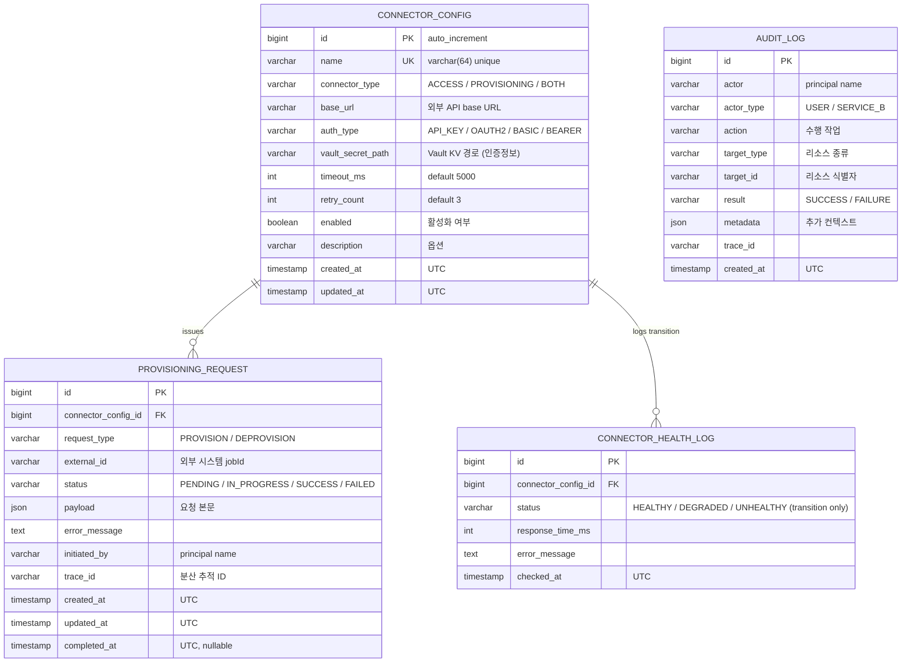

# Data Model (v0.3)

본 문서는 백엔드 RDB(MariaDB) 스키마의 초기 설계를 정리합니다.
범위는 **플랫폼 운영 메타데이터**(외부 커넥터 설정, 프로비저닝 요청, 헬스체크 로그, 감사 로그)에 한정됩니다.

> **Out of scope (의도적으로 제외)**
> - **사용자/역할 테이블**: D-011에 따라 Keycloak에서 중앙 관리. JWT claim으로 전달되므로 로컬 테이블 불필요
> - **인증정보(API Key, Client Secret 등)**: D-004에 따라 Vault에만 저장. DB에는 `vault_secret_path`만 보관
> - **외부 API 응답 캐시**: D-015에 따라 Redis 사용. RDB에 캐시하지 않음
> - **메트릭/로그 시계열 데이터**: Prometheus / Grafana 영역

---

## 0. 결정 사항 요약

| # | 결정 | ADR |
|---|------|-----|
| ① | PK는 `id`, FK는 `<참조테이블>_id` 컨벤션 + JOIN alias 의무 | D-018 |
| ② | `BaseEntity` (`@MappedSuperclass`) 패턴 도입 | D-019 |
| ③ | 시간 컬럼은 `TIMESTAMP` + UTC 컨벤션 | D-020 |
| ④ | JSON 컬럼은 `JSON` 타입 사용 (`TEXT` 아님) | D-021 |
| ⑤ | Flyway 단일 소스 + Spring Batch 메타테이블 통합 + 단계 분리 | D-022 |
| ⑥ | `audit_log` early adoption (M2 #4 / V2) | D-023 |
| ⑦ | `connector_health_log`는 status 변화 시점만 INSERT | D-024 |

---

## 1. 마이그레이션 단계 (Flyway)

| Version | 시점 | 포함 | 비고 |
|---------|------|------|------|
| `V1__init_connector_config.sql` | M2 #4 | `connector_config` | D-017 확정 |
| `V2__init_audit_log.sql` | M2 #4 | `audit_log` | D-023 early adoption |
| `V3__init_spring_batch_schema.sql` | M2 #4 | `BATCH_*` 메타테이블 | `spring-batch-core/org/springframework/batch/core/schema-mariadb.sql` 복사 |
| `V4__init_provisioning_and_health.sql` | M4 | `provisioning_request`, `connector_health_log` | 어댑터 동작 시점 |

**원칙**: 한 마이그레이션 = 한 책임. 리뷰·롤백 용이 (D-022).

**JDBC / JPA 권장 설정** (D-020):

```yaml
spring:
  datasource:
    url: jdbc:mysql://192.168.0.39:33306/backend?serverTimezone=UTC&useLegacyDatetimeCode=false&characterEncoding=UTF-8
  jpa:
    properties:
      hibernate:
        jdbc:
          time_zone: UTC
  batch:
    jdbc:
      initialize-schema: never   # D-022: Flyway 단일 소스
```

---

## 2. ERD



---

## 3. 테이블별 상세

### 3.1 `connector_config` — V1 · D-017 확정

외부 REST API Provider의 런타임 설정.

| 컬럼 | 타입 | 제약 | 설명 |
|------|------|------|------|
| `id` | BIGINT | PK, AUTO_INCREMENT | |
| `name` | VARCHAR(64) | NOT NULL, UNIQUE | 커넥터 식별 이름 (`okta`, `saviynt` 등) |
| `connector_type` | VARCHAR(32) | NOT NULL, CHECK | `ACCESS`, `PROVISIONING`, `BOTH` |
| `base_url` | VARCHAR(255) | NOT NULL | 외부 API base URL |
| `auth_type` | VARCHAR(32) | NOT NULL, CHECK | `API_KEY`, `OAUTH2`, `BASIC`, `BEARER` |
| `vault_secret_path` | VARCHAR(255) | NOT NULL | Vault KV 경로. **DB는 인증정보를 저장하지 않음** |
| `timeout_ms` | INT | NOT NULL, DEFAULT 5000 | WebClient 타임아웃 |
| `retry_count` | INT | NOT NULL, DEFAULT 3 | 재시도 횟수 |
| `enabled` | BOOLEAN | NOT NULL, DEFAULT TRUE | 비활성화 시 Registry에서 제외 |
| `description` | VARCHAR(255) | NULL | 운영자 메모 |
| `created_at` | TIMESTAMP | NOT NULL, DEFAULT CURRENT_TIMESTAMP | UTC |
| `updated_at` | TIMESTAMP | NOT NULL, DEFAULT CURRENT_TIMESTAMP ON UPDATE CURRENT_TIMESTAMP | UTC |

**인덱스**: `UK_connector_config_name(name)`, `IDX_connector_config_enabled(enabled)`

---

### 3.2 `audit_log` — V2 · D-023 early adoption

모든 인증된 사용자/Service B의 변경 작업 추적. INSERT-only.

| 컬럼 | 타입 | 제약 | 설명 |
|------|------|------|------|
| `id` | BIGINT | PK, AUTO_INCREMENT | |
| `actor` | VARCHAR(128) | NOT NULL | principal 이름 (subject claim) |
| `actor_type` | VARCHAR(32) | NOT NULL, CHECK | `USER`, `SERVICE_B` |
| `action` | VARCHAR(64) | NOT NULL | `CONNECTOR_CREATE`, `PROVISION_TRIGGER`, `CACHE_EVICT` 등 |
| `target_type` | VARCHAR(64) | NULL | `CONNECTOR_CONFIG` 등 |
| `target_id` | VARCHAR(128) | NULL | 대상 식별자 |
| `result` | VARCHAR(16) | NOT NULL, CHECK | `SUCCESS`, `FAILURE` |
| `metadata` | JSON | NULL | IP, User-Agent, before/after 등 |
| `trace_id` | VARCHAR(64) | NULL | 분산 추적 ID |
| `created_at` | TIMESTAMP | NOT NULL, DEFAULT CURRENT_TIMESTAMP | UTC |

**인덱스**

- `IDX_audit_actor_created_at(actor, created_at DESC)`
- `IDX_audit_target(target_type, target_id)`
- `IDX_audit_created_at(created_at DESC)`

**보존 정책**: 1년 보존 후 archive (M5 운영 런북에서 정의)

---

### 3.3 `provisioning_request` — V4 · M4

`ProvisioningConnector.provision()` / `deprovision()` 호출 영속화.

| 컬럼 | 타입 | 제약 | 설명 |
|------|------|------|------|
| `id` | BIGINT | PK, AUTO_INCREMENT | 내부 jobId |
| `connector_config_id` | BIGINT | NOT NULL, FK ON DELETE RESTRICT | 어느 커넥터로 발송됐는지 |
| `request_type` | VARCHAR(32) | NOT NULL, CHECK | `PROVISION`, `DEPROVISION` |
| `external_id` | VARCHAR(128) | NULL | 외부 시스템이 반환한 작업 ID |
| `status` | VARCHAR(32) | NOT NULL, CHECK | `PENDING`, `IN_PROGRESS`, `SUCCESS`, `FAILED` |
| `payload` | JSON | NULL | 요청 본문 (재실행 시 참고) |
| `error_message` | TEXT | NULL | 실패 메시지 (스택 트레이스 등 비정형 텍스트) |
| `initiated_by` | VARCHAR(128) | NOT NULL | 호출자 principal |
| `trace_id` | VARCHAR(64) | NULL | |
| `created_at` | TIMESTAMP | NOT NULL, DEFAULT CURRENT_TIMESTAMP | UTC |
| `updated_at` | TIMESTAMP | NOT NULL, DEFAULT CURRENT_TIMESTAMP ON UPDATE CURRENT_TIMESTAMP | UTC |
| `completed_at` | TIMESTAMP | NULL | UTC |

**인덱스**

- `IDX_pr_connector_status(connector_config_id, status)`
- `IDX_pr_external_id(external_id)`
- `IDX_pr_created_at(created_at)`

**FK 정책**: `ON DELETE RESTRICT` — 진행 이력이 있는 커넥터는 삭제 불가, 비활성화(`enabled=false`)만 허용

---

### 3.4 `connector_health_log` — V4 · M4 · D-024

`AccessConnector.healthCheck()` 결과 중 **status가 변경된 시점만** 기록.

| 컬럼 | 타입 | 제약 | 설명 |
|------|------|------|------|
| `id` | BIGINT | PK, AUTO_INCREMENT | |
| `connector_config_id` | BIGINT | NOT NULL, FK ON DELETE CASCADE | |
| `status` | VARCHAR(32) | NOT NULL, CHECK | `HEALTHY`, `DEGRADED`, `UNHEALTHY` |
| `response_time_ms` | INT | NULL | 응답 지연 |
| `error_message` | TEXT | NULL | |
| `checked_at` | TIMESTAMP | NOT NULL | UTC |

**인덱스**: `IDX_chl_connector_checked_at(connector_config_id, checked_at DESC)`

**상태 변화만 기록 — 구현 패턴**

```java
// HealthCheckService 의사코드
public void recordHealthCheck(Long connectorId, HealthStatus newStatus, ...) {
    String lastStatus = jdbcTemplate.queryForObject(
        "SELECT status FROM connector_health_log " +
        "WHERE connector_config_id = ? " +
        "ORDER BY checked_at DESC LIMIT 1",
        String.class, connectorId);

    if (lastStatus == null || !lastStatus.equals(newStatus.name())) {
        // INSERT 새 transition
    }
    // else: 동일 상태 → INSERT 안 함
}
```

**현재 상태 조회 (대시보드용)**

```sql
SELECT cc.name, chl.status, chl.checked_at
FROM connector_config cc
LEFT JOIN connector_health_log chl
  ON chl.id = (
    SELECT MAX(id) FROM connector_health_log
    WHERE connector_config_id = cc.id
  )
WHERE cc.enabled = TRUE;
```

**FK 정책**: `ON DELETE CASCADE` — 커넥터 삭제 시 헬스 이력도 함께 정리

---

## 4. JPA 매핑 가이드 (D-018, D-019)

### 4.1 BaseEntity 계층

```java
// 모든 일반 엔티티의 부모
@MappedSuperclass
@EntityListeners(AuditingEntityListener.class)
public abstract class BaseEntity {

    @Id
    @GeneratedValue(strategy = GenerationType.IDENTITY)
    private Long id;

    @CreatedDate
    @Column(name = "created_at", nullable = false, updatable = false)
    private LocalDateTime createdAt;

    @LastModifiedDate
    @Column(name = "updated_at", nullable = false)
    private LocalDateTime updatedAt;

    public Long getId() { return id; }
    public LocalDateTime getCreatedAt() { return createdAt; }
    public LocalDateTime getUpdatedAt() { return updatedAt; }
}

// audit_log 같은 INSERT-only 테이블용 (updated_at 없음)
@MappedSuperclass
@EntityListeners(AuditingEntityListener.class)
public abstract class CreatedAtEntity {

    @Id
    @GeneratedValue(strategy = GenerationType.IDENTITY)
    private Long id;

    @CreatedDate
    @Column(name = "created_at", nullable = false, updatable = false)
    private LocalDateTime createdAt;

    public Long getId() { return id; }
    public LocalDateTime getCreatedAt() { return createdAt; }
}
```

`@EnableJpaAuditing`을 `@Configuration` 클래스에 추가해야 `@CreatedDate`/`@LastModifiedDate`가 동작합니다.

### 4.2 엔티티 예시

```java
@Entity
@Table(name = "connector_config")
@Getter
public class ConnectorConfig extends BaseEntity {

    @Column(name = "name", nullable = false, length = 64, unique = true)
    private String name;

    @Enumerated(EnumType.STRING)
    @Column(name = "connector_type", nullable = false, length = 32)
    private ConnectorType connectorType;

    @Column(name = "base_url", nullable = false, length = 255)
    private String baseUrl;

    @Enumerated(EnumType.STRING)
    @Column(name = "auth_type", nullable = false, length = 32)
    private AuthType authType;

    @Column(name = "vault_secret_path", nullable = false, length = 255)
    private String vaultSecretPath;

    @Column(name = "timeout_ms", nullable = false)
    private Integer timeoutMs = 5000;

    @Column(name = "retry_count", nullable = false)
    private Integer retryCount = 3;

    @Column(name = "enabled", nullable = false)
    private Boolean enabled = true;

    @Column(name = "description", length = 255)
    private String description;
}

@Entity
@Table(name = "audit_log")
@Getter
public class AuditLog extends CreatedAtEntity {

    @Column(name = "actor", nullable = false, length = 128)
    private String actor;

    @Enumerated(EnumType.STRING)
    @Column(name = "actor_type", nullable = false, length = 32)
    private ActorType actorType;

    // ...

    @Column(name = "metadata", columnDefinition = "JSON")
    private String metadata;   // JSON 직렬화된 String
}
```

### 4.3 JOIN 작성 컨벤션 (D-018)

- 테이블 별칭은 항상 사용 (별칭 미사용 금지)
- 별칭은 짧게: `connector_config` → `cc`, `provisioning_request` → `pr`, `audit_log` → `al`, `connector_health_log` → `chl`
- `USING` 절은 사용하지 않음 (PK가 `id`이고 FK는 `<table>_id`라 매칭이 안 되므로)

```sql
-- 권장
SELECT cc.name, pr.status
FROM connector_config cc
JOIN provisioning_request pr ON pr.connector_config_id = cc.id
WHERE cc.enabled = TRUE;
```

---

## 5. DDL 스니펫

> Claude Code는 아래 DDL을 `src/main/resources/db/migration/` 하위 파일로 그대로 사용 가능.

### 5.1 `V1__init_connector_config.sql`

```sql
CREATE TABLE connector_config (
    id                BIGINT       NOT NULL AUTO_INCREMENT,
    name              VARCHAR(64)  NOT NULL,
    connector_type    VARCHAR(32)  NOT NULL,
    base_url          VARCHAR(255) NOT NULL,
    auth_type         VARCHAR(32)  NOT NULL,
    vault_secret_path VARCHAR(255) NOT NULL,
    timeout_ms        INT          NOT NULL DEFAULT 5000,
    retry_count       INT          NOT NULL DEFAULT 3,
    enabled           BOOLEAN      NOT NULL DEFAULT TRUE,
    description       VARCHAR(255) NULL,
    created_at        TIMESTAMP    NOT NULL DEFAULT CURRENT_TIMESTAMP,
    updated_at        TIMESTAMP    NOT NULL DEFAULT CURRENT_TIMESTAMP
                                            ON UPDATE CURRENT_TIMESTAMP,
    PRIMARY KEY (id),
    UNIQUE KEY uk_connector_config_name (name),
    KEY idx_connector_config_enabled (enabled),
    CONSTRAINT chk_connector_type
        CHECK (connector_type IN ('ACCESS','PROVISIONING','BOTH')),
    CONSTRAINT chk_auth_type
        CHECK (auth_type IN ('API_KEY','OAUTH2','BASIC','BEARER'))
) ENGINE=InnoDB DEFAULT CHARSET=utf8mb4 COLLATE=utf8mb4_unicode_ci;
```

### 5.2 `V2__init_audit_log.sql`

```sql
CREATE TABLE audit_log (
    id          BIGINT       NOT NULL AUTO_INCREMENT,
    actor       VARCHAR(128) NOT NULL,
    actor_type  VARCHAR(32)  NOT NULL,
    action      VARCHAR(64)  NOT NULL,
    target_type VARCHAR(64)  NULL,
    target_id   VARCHAR(128) NULL,
    result      VARCHAR(16)  NOT NULL,
    metadata    JSON         NULL,
    trace_id    VARCHAR(64)  NULL,
    created_at  TIMESTAMP    NOT NULL DEFAULT CURRENT_TIMESTAMP,
    PRIMARY KEY (id),
    KEY idx_audit_actor_created_at (actor, created_at),
    KEY idx_audit_target (target_type, target_id),
    KEY idx_audit_created_at (created_at),
    CONSTRAINT chk_audit_actor_type
        CHECK (actor_type IN ('USER','SERVICE_B')),
    CONSTRAINT chk_audit_result
        CHECK (result IN ('SUCCESS','FAILURE'))
) ENGINE=InnoDB DEFAULT CHARSET=utf8mb4 COLLATE=utf8mb4_unicode_ci;
```

### 5.3 `V3__init_spring_batch_schema.sql`

> `spring-batch-core` 의존성 jar 안의
> `org/springframework/batch/core/schema-mariadb.sql`을 그대로 복사해 사용.
> Spring Boot 3.5 / Spring Batch 5.x 기준 테이블: `BATCH_JOB_INSTANCE`, `BATCH_JOB_EXECUTION`, `BATCH_JOB_EXECUTION_PARAMS`, `BATCH_JOB_EXECUTION_CONTEXT`, `BATCH_STEP_EXECUTION`, `BATCH_STEP_EXECUTION_CONTEXT`, `BATCH_JOB_SEQ`, `BATCH_STEP_EXECUTION_SEQ`, `BATCH_JOB_EXECUTION_SEQ`.
>
> 함께 적용할 설정: `application.yml`에 `spring.batch.jdbc.initialize-schema: never` (D-022)

### 5.4 `V4__init_provisioning_and_health.sql`

```sql
CREATE TABLE provisioning_request (
    id                  BIGINT       NOT NULL AUTO_INCREMENT,
    connector_config_id BIGINT       NOT NULL,
    request_type        VARCHAR(32)  NOT NULL,
    external_id         VARCHAR(128) NULL,
    status              VARCHAR(32)  NOT NULL,
    payload             JSON         NULL,
    error_message       TEXT         NULL,
    initiated_by        VARCHAR(128) NOT NULL,
    trace_id            VARCHAR(64)  NULL,
    created_at          TIMESTAMP    NOT NULL DEFAULT CURRENT_TIMESTAMP,
    updated_at          TIMESTAMP    NOT NULL DEFAULT CURRENT_TIMESTAMP
                                              ON UPDATE CURRENT_TIMESTAMP,
    completed_at        TIMESTAMP    NULL,
    PRIMARY KEY (id),
    KEY idx_pr_connector_status (connector_config_id, status),
    KEY idx_pr_external_id (external_id),
    KEY idx_pr_created_at (created_at),
    CONSTRAINT fk_pr_connector
        FOREIGN KEY (connector_config_id)
        REFERENCES connector_config (id)
        ON DELETE RESTRICT,
    CONSTRAINT chk_pr_request_type
        CHECK (request_type IN ('PROVISION','DEPROVISION')),
    CONSTRAINT chk_pr_status
        CHECK (status IN ('PENDING','IN_PROGRESS','SUCCESS','FAILED'))
) ENGINE=InnoDB DEFAULT CHARSET=utf8mb4 COLLATE=utf8mb4_unicode_ci;

CREATE TABLE connector_health_log (
    id                  BIGINT       NOT NULL AUTO_INCREMENT,
    connector_config_id BIGINT       NOT NULL,
    status              VARCHAR(32)  NOT NULL,
    response_time_ms    INT          NULL,
    error_message       TEXT         NULL,
    checked_at          TIMESTAMP    NOT NULL,
    PRIMARY KEY (id),
    KEY idx_chl_connector_checked_at (connector_config_id, checked_at),
    CONSTRAINT fk_chl_connector
        FOREIGN KEY (connector_config_id)
        REFERENCES connector_config (id)
        ON DELETE CASCADE,
    CONSTRAINT chk_chl_status
        CHECK (status IN ('HEALTHY','DEGRADED','UNHEALTHY'))
) ENGINE=InnoDB DEFAULT CHARSET=utf8mb4 COLLATE=utf8mb4_unicode_ci;
```

---

## 6. 참고 결정 사항 (`docs/DECISIONS.md`)

| ADR | 내용 |
|-----|------|
| D-004 | 시크릿은 Vault만 사용 |
| D-011 | 사용자/역할은 Keycloak 중앙 관리 |
| D-015 | 캐시는 Redis |
| D-016 | HikariCP 풀 사이즈 = `(DB max_connections - 10) / 최대 파드 수` |
| D-017 | `connector_config` 컬럼 정의 |
| D-018 | PK / FK 네이밍 컨벤션 |
| D-019 | BaseEntity (`@MappedSuperclass`) 도입 |
| D-020 | TIMESTAMP + UTC 컨벤션 |
| D-021 | JSON 컬럼 타입 채택 |
| D-022 | Flyway 단일 소스, 단계 분리 |
| D-023 | `audit_log` Early Adoption |
| D-024 | `connector_health_log` 상태 변화 시점만 기록 |

---

## 7. 향후 추가 검토 (현재는 보류)

- `connector_config`에 `last_health_status` / `last_health_checked_at` 캐시 컬럼 추가 여부
- 다국어 지원이 필요해질 경우 `description`을 별도 i18n 테이블로 분리
- audit_log 분할(파티셔닝) — 데이터 누적 후 결정
- `audit_log.action`의 표준 카탈로그 정의 (Enum)
