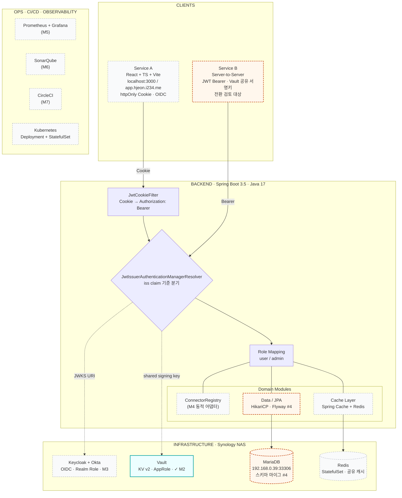
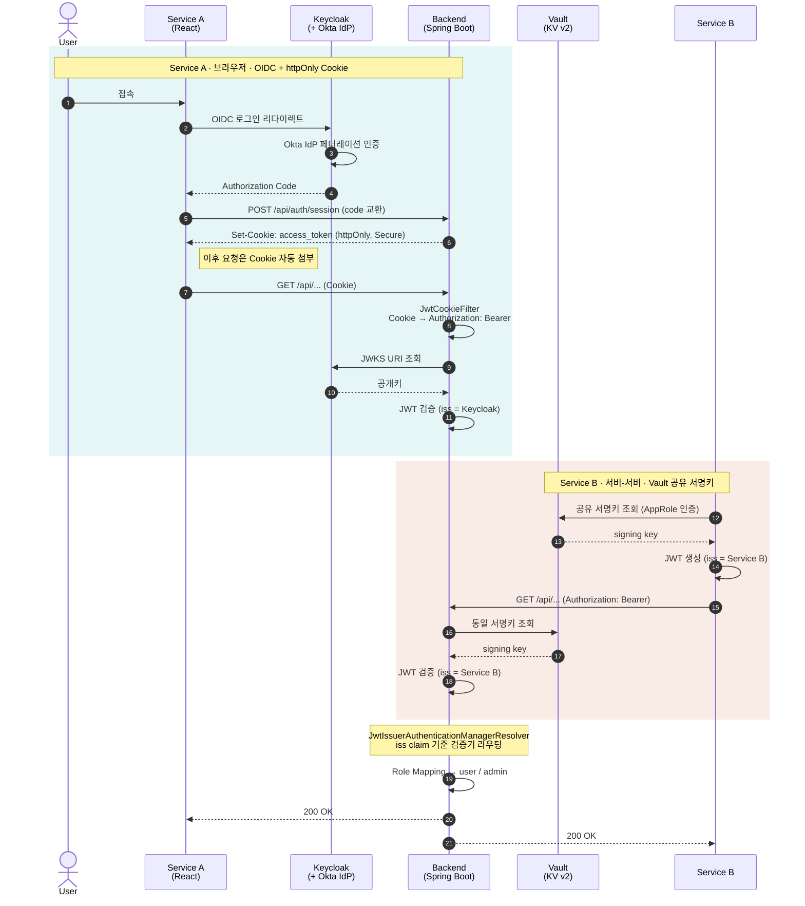

# Diagrams

프로젝트 현재 상태를 시각화한 Mermaid 다이어그램 모음입니다.
GitHub, IntelliJ IDEA, VS Code (Markdown Preview Mermaid 지원) 등에서 그대로 렌더링됩니다.

개별 `.mermaid` 파일은 `docs/diagrams/` 폴더에 함께 보관되어 있어 다른 문서에서 임베드해 쓸 수 있습니다.

상태 표기

- 실선 + teal 보더: 완료 (✓)
- 실선 + orange 보더: 진행 중 / 다음 작업
- 점선 + gray 보더: 대기

---

## 1. System Architecture (현재 상태)

3-tier 구조로 클라이언트, Spring Boot 백엔드, 인프라, 운영 스택을 한눈에 정리.
Multi-issuer JWT 분기는 백엔드 내부의 `JwtIssuerAuthenticationManagerResolver`에서 일어나며, 이후 도메인 모듈(Connector / Cache / Data)로 이어집니다.



---

## 2. Multi-issuer JWT 인증 흐름

Service A(브라우저)는 Cookie 기반 OIDC, Service B(서버-서버)는 Vault 공유 서명키 기반 JWT를 사용합니다.
백엔드는 두 흐름을 단일 Security 필터 체인에서 `iss` 클레임으로 분기 검증합니다.



---

## 3. 마일스톤 로드맵 M1~M8

M1 Bootstrap 및 M2 Vault 완료, M2 MariaDB 마이그레이션이 진행 중입니다.
이후 M3 인증 → M4 동적 어댑터 → M5 관측성 → M6 품질 → M7 CI/CD → M8 프로덕션 준비 순서로 이어집니다.
Redis는 M3~M4 사이에 추가 도입됩니다.

```mermaid
flowchart LR

    subgraph FOUNDATION[" Foundation "]
        direction TB
        M1["M1 · Bootstrap<br/>Spring Boot 3.5 baseline<br/>dev / prod profile"]
        M2V["M2 · Vault<br/>KV v2 · AppRole<br/>✓ 완료"]
        M2D["M2 · MariaDB Migration<br/>Flyway 도입 · 초기 스키마<br/>● 진행 중 (#4)"]
    end

    subgraph PLATFORM[" Auth & Platform "]
        direction TB
        M3["M3 · Auth Foundation<br/>Multi-issuer JWT<br/>Service A UI<br/>Keycloak-Okta federation"]
        REDIS["+ Redis StatefulSet<br/>Spring Cache 활성화<br/>(M3~M4 사이 도입)"]
        M4["M4 · Connector FW<br/>Access / Provisioning<br/>ConnectorRegistry<br/>connector_config 테이블"]
    end

    subgraph OBS[" Observability & Quality "]
        direction TB
        M5["M5 · Observability<br/>Prometheus + Grafana<br/>HikariCP · Cache 메트릭"]
        M6["M6 · Quality Gate<br/>SonarQube<br/>PR 품질 게이팅"]
    end

    subgraph DELIVERY[" Delivery "]
        direction TB
        M7["M7 · CI/CD<br/>CircleCI 파이프라인<br/>K8s Deploy"]
        M8["M8 · Production Ready<br/>Homelab + AWS Test<br/>런북 · 복구 · 롤백"]
    end

    M1 --> M2V --> M2D --> M3 --> M4 --> M5 --> M6 --> M7 --> M8
    M3 -. "Redis 도입" .-> REDIS
    REDIS -. "캐시 사용" .-> M4

    classDef done stroke:#0ea5a4,stroke-width:2px,fill:#ecfeff
    classDef active stroke:#c2410c,stroke-width:2px,fill:#fff7ed
    classDef pend stroke:#9ca3af,stroke-dasharray:4 3,fill:#f9fafb

    class M1,M2V done
    class M2D active
    class M3,M4,M5,M6,M7,M8,REDIS pend
```



---

## 렌더링 / 편집 팁

- VS Code: **Markdown Preview Mermaid Support** 확장 설치 후 미리보기 패널에서 즉시 확인
- IntelliJ IDEA / GoLand: 내장 Mermaid 지원 (Settings → Languages & Frameworks → Markdown → Mermaid 활성화)
- GitHub: `.md` 파일의 ` ```mermaid ` 블록을 자동 렌더링
- Mermaid Live Editor (https://mermaid.live): 다이어그램 한 개씩 붙여넣어 실시간 편집 가능
- 색상 변경은 각 다이어그램 하단의 `classDef` 라인을 수정하면 됩니다
