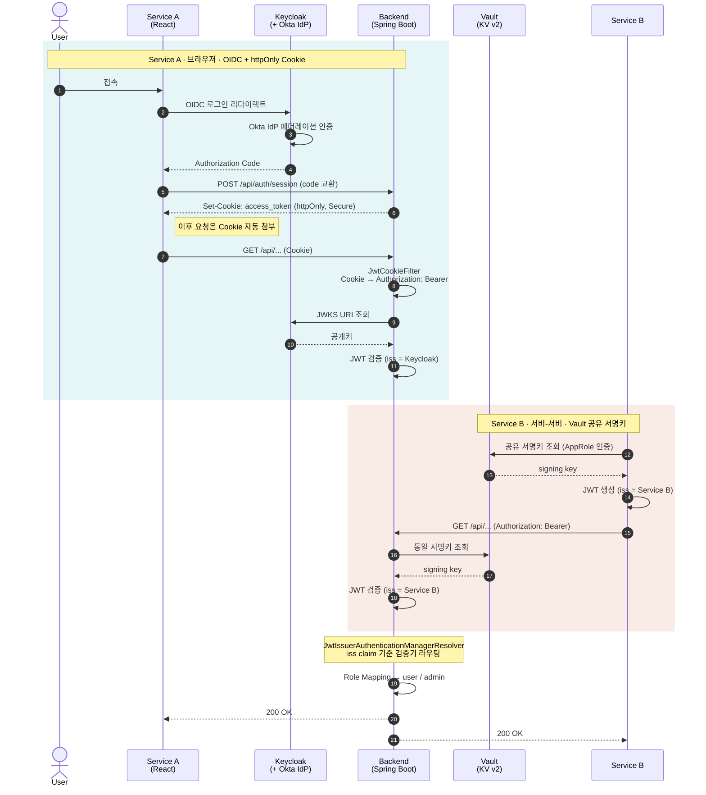

# Multi-issuer JWT Authentication Flow

Service A(브라우저)는 Cookie 기반 OIDC, Service B(서버-서버)는 Vault 공유 서명키 기반 JWT를 사용합니다.
백엔드는 두 흐름을 단일 Security 필터 체인에서 `iss` 클레임으로 분기 검증합니다.

```mermaid
sequenceDiagram
    autonumber
    actor U as User
    participant SA as Service A<br/>(React)
    participant KC as Keycloak<br/>(+ Okta IdP)
    participant BE as Backend<br/>(Spring Boot)
    participant V as Vault<br/>(KV v2)
    participant SB as Service B

    rect rgba(14, 165, 164, 0.10)
        Note over U,BE: Service A · 브라우저 · OIDC + httpOnly Cookie
        U->>SA: 접속
        SA->>KC: OIDC 로그인 리다이렉트
        KC->>KC: Okta IdP 페더레이션 인증
        KC-->>SA: Authorization Code
        SA->>BE: POST /api/auth/session (code 교환)
        BE-->>SA: Set-Cookie: access_token (httpOnly, Secure)
        Note right of SA: 이후 요청은 Cookie 자동 첨부
        SA->>BE: GET /api/... (Cookie)
        BE->>BE: JwtCookieFilter<br/>Cookie → Authorization: Bearer
        BE->>KC: JWKS URI 조회
        KC-->>BE: 공개키
        BE->>BE: JWT 검증 (iss = Keycloak)
    end

    rect rgba(194, 65, 12, 0.10)
        Note over SB,V: Service B · 서버-서버 · Vault 공유 서명키
        SB->>V: 공유 서명키 조회 (AppRole 인증)
        V-->>SB: signing key
        SB->>SB: JWT 생성 (iss = Service B)
        SB->>BE: GET /api/... (Authorization: Bearer)
        BE->>V: 동일 서명키 조회
        V-->>BE: signing key
        BE->>BE: JWT 검증 (iss = Service B)
    end

    Note over BE: JwtIssuerAuthenticationManagerResolver<br/>iss claim 기준 검증기 라우팅
    BE->>BE: Role Mapping → user / admin
    BE-->>SA: 200 OK
    BE-->>SB: 200 OK
```
