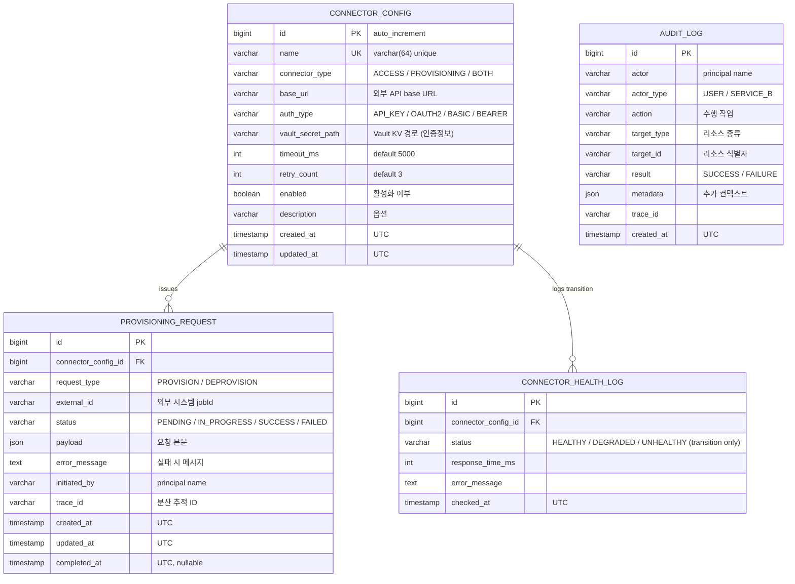

# ERD (v0.3)

플랫폼 운영 메타데이터의 ERD입니다. 상세 사양·DDL·결정 사항은 [`docs/DATA_MODEL.md`](../DATA_MODEL.md), 결정 배경은 [`docs/DECISIONS.md`](../DECISIONS.md) 참고.

**테이블 구성**

- Phase 1 (M2 #4 · 확정): `connector_config`, `audit_log`
- Phase 2 (M4): `provisioning_request`, `connector_health_log`
- 별도 (M2 #4): Spring Batch 메타테이블 (spring-batch-core 제공 스크립트, V3로 적용)

**주요 결정사항**

- PK는 `id`, FK는 `<참조테이블>_id` (D-018)
- 시간 컬럼은 `TIMESTAMP` + UTC 컨벤션 (D-020)
- JSON 컬럼은 `JSON` 타입 (D-021)
- `connector_health_log`는 status 변화 시점만 INSERT (D-024)

