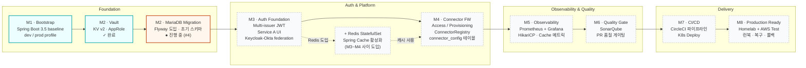

# Milestone Roadmap M1~M8

M1 Bootstrap 및 M2 Vault 완료, M2 MariaDB 마이그레이션이 진행 중입니다.
이후 M3 인증 → M4 동적 어댑터 → M5 관측성 → M6 품질 → M7 CI/CD → M8 프로덕션 준비 순서로 이어집니다.
Redis는 M3~M4 사이에 추가 도입됩니다.

```mermaid
flowchart LR

    subgraph FOUNDATION[" Foundation "]
        direction TB
        M1["M1 · Bootstrap<br/>Spring Boot 3.5 baseline<br/>dev / prod profile"]
        M2V["M2 · Vault<br/>KV v2 · AppRole<br/>✓ 완료"]
        M2D["M2 · MariaDB Migration<br/>Flyway 도입 · 초기 스키마<br/>● 진행 중 (#4)"]
    end

    subgraph PLATFORM[" Auth & Platform "]
        direction TB
        M3["M3 · Auth Foundation<br/>Multi-issuer JWT<br/>Service A UI<br/>Keycloak-Okta federation"]
        REDIS["+ Redis StatefulSet<br/>Spring Cache 활성화<br/>(M3~M4 사이 도입)"]
        M4["M4 · Connector FW<br/>Access / Provisioning<br/>ConnectorRegistry<br/>connector_config 테이블"]
    end

    subgraph OBS[" Observability & Quality "]
        direction TB
        M5["M5 · Observability<br/>Prometheus + Grafana<br/>HikariCP · Cache 메트릭"]
        M6["M6 · Quality Gate<br/>SonarQube<br/>PR 품질 게이팅"]
    end

    subgraph DELIVERY[" Delivery "]
        direction TB
        M7["M7 · CI/CD<br/>CircleCI 파이프라인<br/>K8s Deploy"]
        M8["M8 · Production Ready<br/>Homelab + AWS Test<br/>런북 · 복구 · 롤백"]
    end

    M1 --> M2V --> M2D --> M3 --> M4 --> M5 --> M6 --> M7 --> M8
    M3 -. "Redis 도입" .-> REDIS
    REDIS -. "캐시 사용" .-> M4

    classDef done stroke:#0ea5a4,stroke-width:2px,fill:#ecfeff
    classDef active stroke:#c2410c,stroke-width:2px,fill:#fff7ed
    classDef pend stroke:#9ca3af,stroke-dasharray:4 3,fill:#f9fafb

    class M1,M2V done
    class M2D active
    class M3,M4,M5,M6,M7,M8,REDIS pend
```
