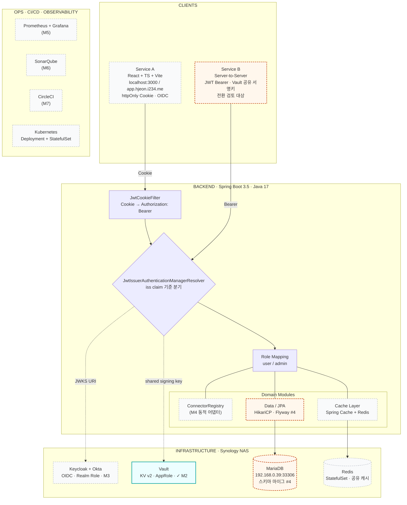

# System Architecture

3-tier 구조로 클라이언트, Spring Boot 백엔드, 인프라, 운영 스택을 한눈에 정리합니다.
Multi-issuer JWT 분기는 백엔드 내부 `JwtIssuerAuthenticationManagerResolver`에서 일어나며, 이후 도메인 모듈(Connector / Cache / Data)로 이어집니다.

**상태 표기**

- 실선 + teal 보더: 완료
- 실선 + orange 보더: 진행 중 / 다음 작업
- 점선 + gray 보더: 대기

